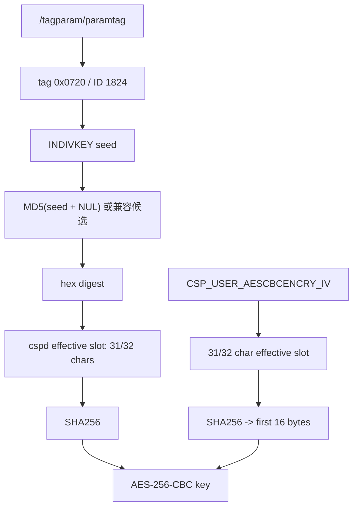

# 密钥与 INDIVKEY

## 已验证的转换

数据库 AES 使用字符串参数而不是直接把可见字符串当作 16/24/32 字节 AES key：

```text
physical_key = SHA256(key_string[0:31])
physical_iv  = SHA256(iv_string[0:31])[0:16]
AES-256-CBC(physical_key, physical_iv)
```

当前 G7615 样本中：

```text
default: DBDefAESCBCKey=PON_Dkey, DBDefAESCBCIV=PON_DIV
user:    tag 0x0720 / ID 1824 -> INDIVKEY seed
user IV: CSP_USER_AESCBCENCRY_IV 的有效 slot 字符串
```

`CSP_USER_AESCBCENCRY_KEY` 是旧/备用来源，不能因为它存在就认定它是当前
`db_user_cfg.xml` 的主 key。当前样本的 user key 是 INDIVKEY 派生结果。

## INDIVKEY 读取

`paramtag` entry 的字段是 little-endian：`u16 id, u16 max_len, u16 val_len,
value`。ID 1824 十六进制为 `0x0720`。设备脚本读取该值，计算包含末尾 NUL
的 MD5，并输出 31 字节有效 slot 字符串。Python 端保留 full/truncated 与
NUL/no-NUL 四种模式，因为不同固件可能在 C 字符串长度和 slot 拷贝处不同。



## 不参与的内容

就当前样本而言，LOID、宽带注册号、型号名和用户 XML 中的业务数据没有被证明
参与 user DB key 派生。它们可能参与设备恢复策略或其他业务逻辑，不能据此推广
到所有固件。

## 自动选择原则

候选 key 只有在以下条件全部通过时才算成功：外层 Magic、AES 块长度、内层 Magic、
分块长度、zlib 解压、XML 前缀；使用 `--strict-crc` 时还必须通过两个 CRC 和
内容总长度。失败候选只记录错误，不写入 XML。

