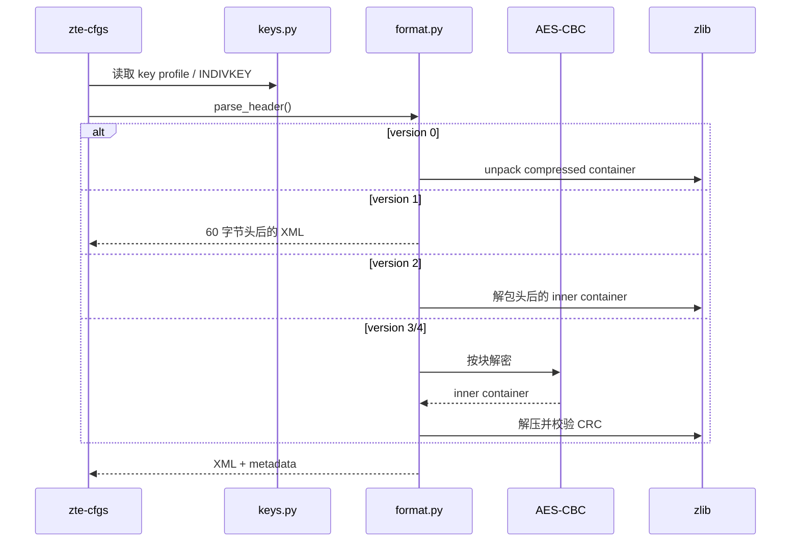
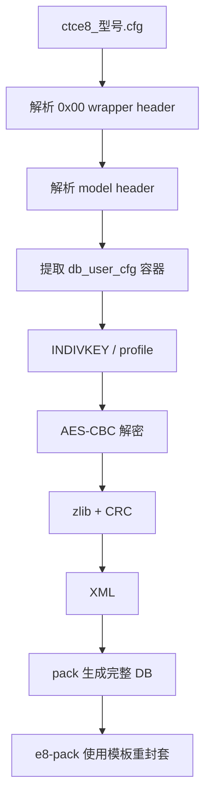

# 操作流程与调用关系

## 本地离线流程

## 数据库解包调用关系

## e8 封套关系

## 设备生命周期边界

本项目只负责离线文件：`cspd` 在设备启动时把文件加载到 shared memory，运行态
修改由 `sendcmd`/`ztedbcli` 写入 DB server，保存流程再生成文件。离线替换前应
停止会覆盖配置的管理流程，保留原文件和 checksum，并通过设备自身的导入/保存
路径验证；不要把跨设备 key 或跨设备 e8 备份当作可移植配置。

